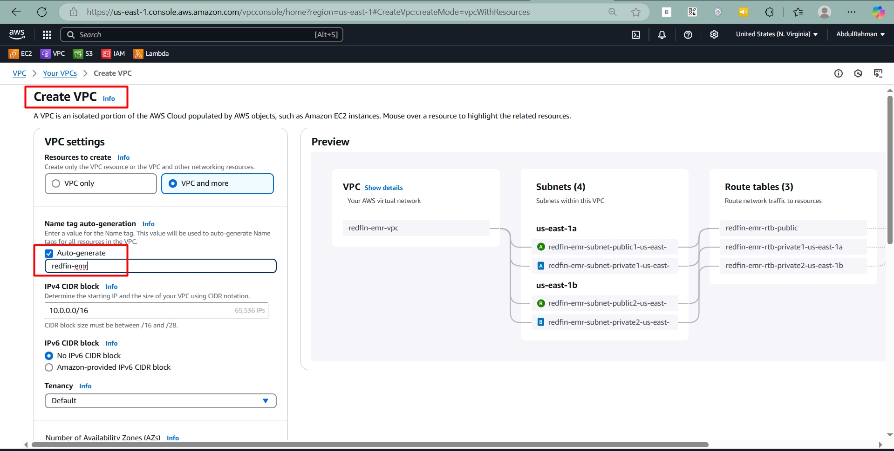
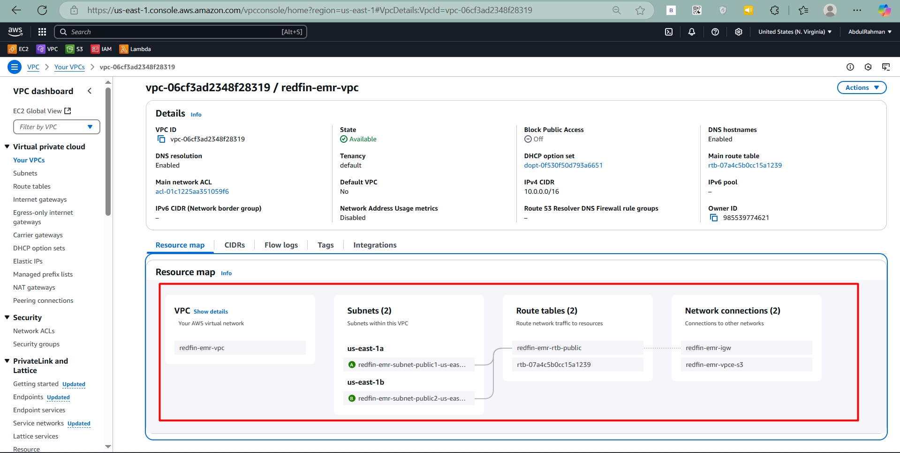
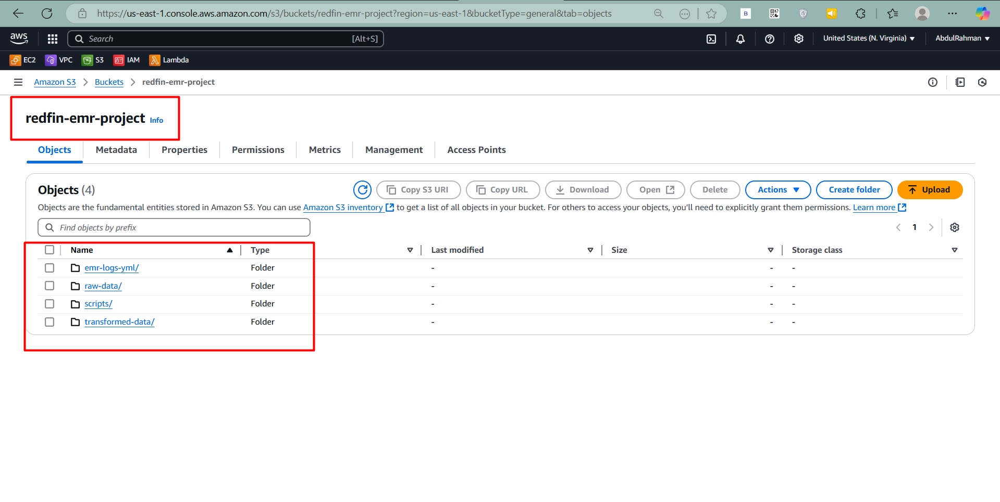
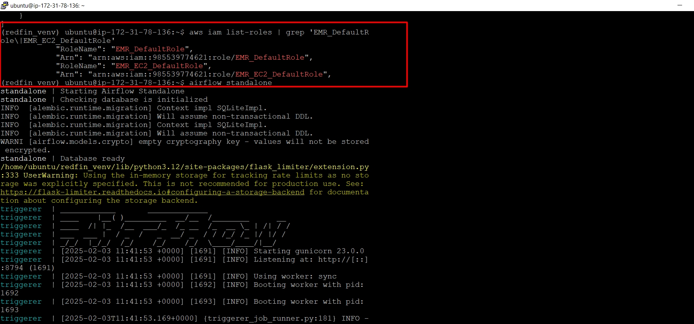
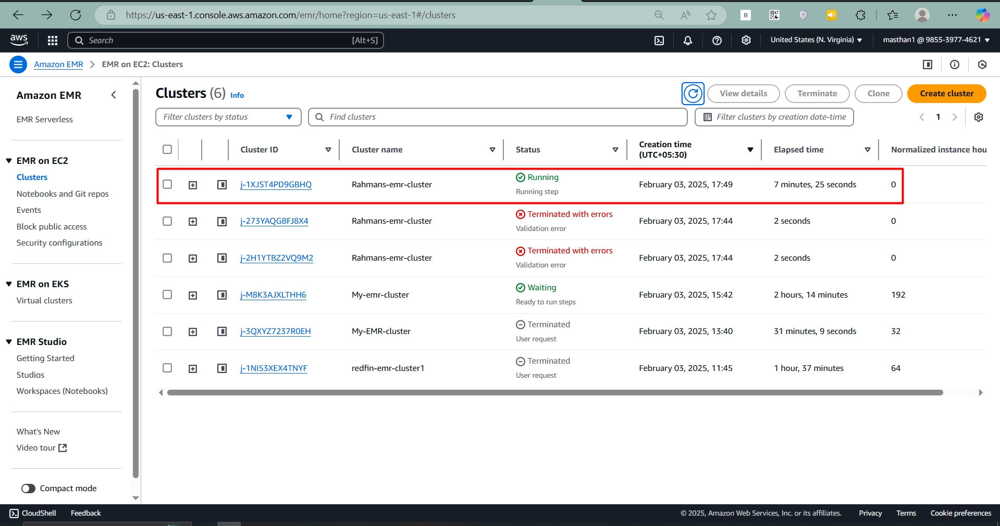
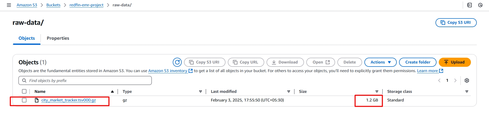
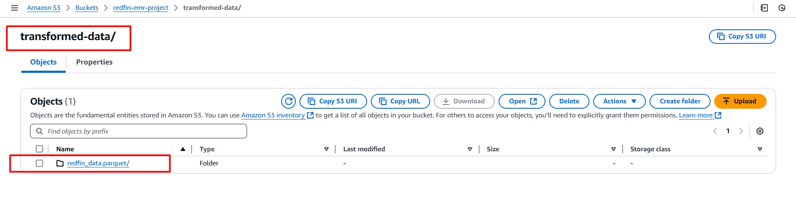
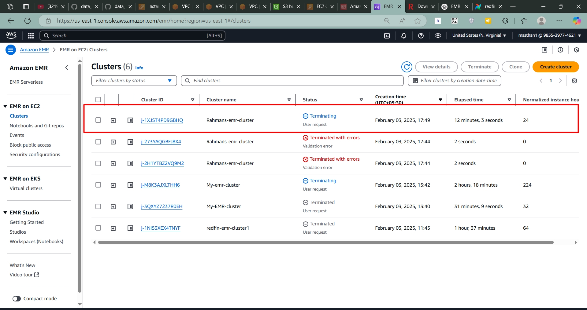
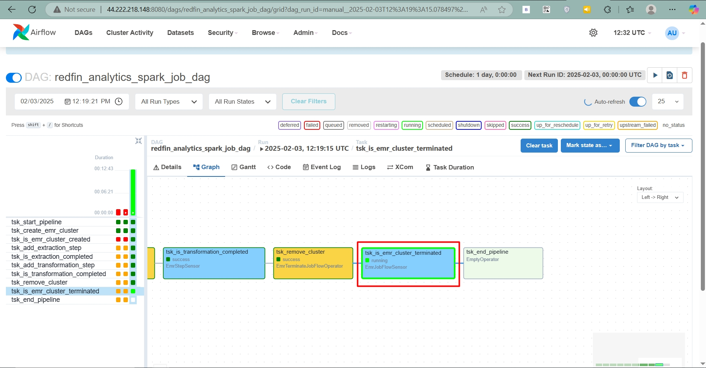
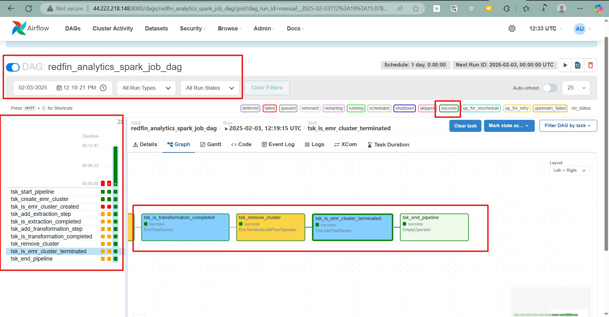

# 🚀 Automated Big Data ETL Pipeline: Scalable Processing with AWS EMR, Airflow, and Snowflake ❄️

## 🏢 Introduction

This project demonstrates how to build an **automated big data ETL pipeline** using **Apache Airflow 📚**, **Amazon EMR 📊**, **Amazon S3 💾**, and **Snowflake ❄️**. The pipeline:

- 🏭 **Creates an EMR Cluster**
- 🔥 Runs **Spark jobs** to process raw data
- 💾 Stores the transformed data in **Amazon S3**
- ❄️ Loads the processed data into **Snowflake**
- 🚫 Shuts down the **EMR cluster** after processing

The DAG is orchestrated using **Apache Airflow**, automating the entire ETL process. ⚙️

---

## 📁 Repository Structure

### 🛠️ Clone the Project

```sh
git clone https://github.com/Abd-al-RahmanH/Automated-Big-Data-ETL-Pipeline-Scalable-Processing-with-AWS-EMR-Airflow-and-Snowflake.git

cd Automated-Big-Data-ETL-Pipeline-Scalable-Processing-with-AWS-EMR-Airflow-and-Snowflake
```

### 📌 Project Files

```
FINAL_EMR_REDFIN/
│-- dags/
│   ├-- redfin_analytics.py       # Airflow DAG for EMR cluster and Spark jobs
│
│-- scripts/
│   ├-- ingest.sh                 # Shell script for data ingestion
│   ├-- transform_redfin_data.py  # Spark script for data transformation
│
│-- commands.txt  # Commands for setting up AWS & Airflow
│-- README.md     # Project Documentation
│-- requirements.txt  # Python dependencies
```

---

## ⚡ Prerequisites

Before running the project, ensure you have the following:

✔️ **AWS Account** with permissions for VPC, S3, EMR, IAM, and Snowflake integration  
✔️ **S3 Bucket** for raw and processed data  
✔️ **Apache Airflow 📚** installed and configured  
✔️ **AWS credentials** configured in Airflow  
✔️ **Snowflake ❄️ Account** with the necessary database and tables  

---

## 🛡️ Step 1: Setting Up a VPC

Before creating an S3 bucket, set up a **VPC (Virtual Private Cloud)** to ensure a secure and controlled networking environment.

### 🔹 Create a VPC

```sh
aws ec2 create-vpc --cidr-block 10.0.0.0/16
```

### 🔹 Create a Subnet

```sh
aws ec2 create-subnet --vpc-id <your-vpc-id> --cidr-block 10.0.1.0/24
```

### 🔹 Create an Internet Gateway

```sh
aws ec2 create-internet-gateway
aws ec2 attach-internet-gateway --vpc-id <your-vpc-id> --internet-gateway-id <your-igw-id>
```

### Create in UI by follow the image




---

## 💾 Step 2: Setting Up an S3 Bucket

Create an **S3 bucket** with the following structure:

```
s3://redfin-emr-project/
├-- raw-data/            # Stores raw CSV data
├-- scripts/             # Stores Spark and ingestion scripts
├-- transformed-data/    # Stores processed parquet files
├-- emr-logs/            # Stores EMR logs
```



Upload necessary scripts to the S3 bucket:

```sh
aws s3 cp scripts/ s3://redfin-emr-project/scripts/ --recursive
```

---

## 🔄 Step 3: Configuring Airflow DAG

The **redfin_analytics.py** DAG automates the ETL workflow.

### 🔗 DAG Flow:

1️⃣ **Start pipeline** (`tsk_start_pipeline`)  
2️⃣ **Create EMR cluster** (`tsk_create_emr_cluster`)  
3️⃣ **Check cluster status** (`tsk_is_emr_cluster_created`)  
4️⃣ **Submit Spark jobs** (`tsk_add_extraction_step`, `tsk_add_transformation_step`)  
5️⃣ **Check Spark job completion** (`tsk_is_extraction_completed`, `tsk_is_transformation_completed`)  
6️⃣ **Load data into Snowflake** (`tsk_load_to_snowflake`)  
7️⃣ **Terminate EMR cluster** (`tsk_remove_cluster`)  
8️⃣ **End pipeline** (`tsk_end_pipeline`)  

### ⚡ Key Configurations in the DAG

Ensure to update the following in `redfin_analytics.py`:

- ✅ **Change the Subnet ID**: `Ec2SubnetId": "subnet-XXXXXX"`
- ✅ **Update EMR Cluster Name**: `"Name": "Your-EMR-Cluster-Name"`
- ✅ **Specify Your Key Name**: `"Ec2KeyName": "YourKeyName"`
- ✅ **Update S3 Bucket Name**: `s3://your-default-bucket-name/`

## Make sure u add the role from the commnads.txt



---

## ▶️ Step 4: Running the DAG

1️⃣ Start the **Airflow webserver and scheduler**:

```sh
airflow webserver -p 8080 &
airflow scheduler &
```

2️⃣ Open **Airflow UI** (http://localhost:8080)  and get th password from the terminal
3️⃣ Enable the DAG: `redfin_analytics_spark_job_dag` by clicking play button


4️⃣ Trigger the DAG manually or wait for its scheduled execution  

## ▶️ Step 5: The job runs
1. After you executed the job will creat the **EMR cluster**



2. It will fetch the raw data



3. It will passed to spark jobs from processing and put the changed job in transformed data s3 bucket



4. After that the emr cluster will be terminated automatically






5. And the job is completed



---

## 🛠️ Step 5: Troubleshooting

### ❗ Common Issues & Fixes

- ❌ **EMR creation fails?** Ensure correct **subnet ID** and **AWS key pair**.
- ❌ **S3 path issues?** Verify bucket structure and permissions.
- 🔍 **Airflow task failure?** Check **task logs** and IAM roles.

---

## ✅ Conclusion

✔️ Fully automated **ETL pipeline** with Apache Airflow 📚  
✔️ Scalable **Spark jobs** on AWS EMR 📊  
✔️ Secure **data storage** in Amazon S3 & Snowflake ❄️  
✔️ Seamless **orchestration** for big data processing 🎯  

For any queries, feel free to contribute to the project! 🙌

