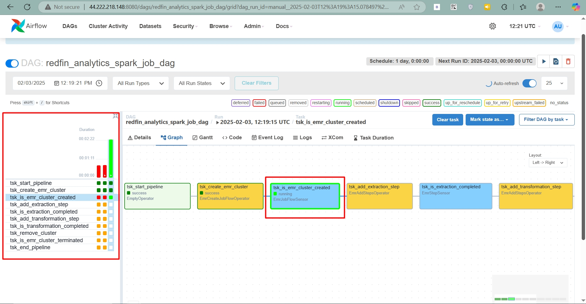
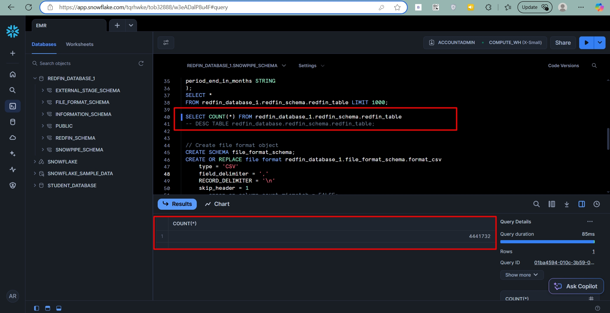
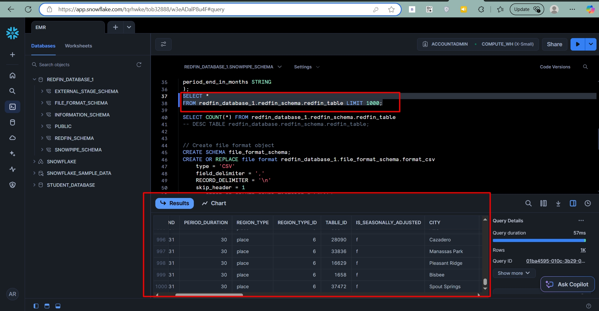
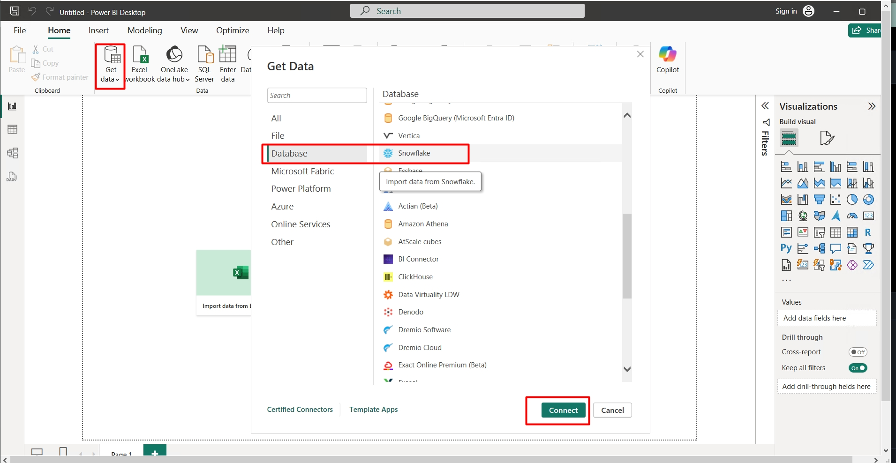
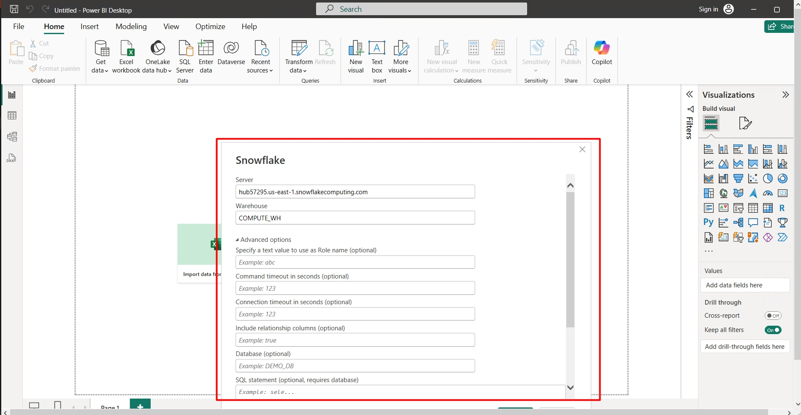
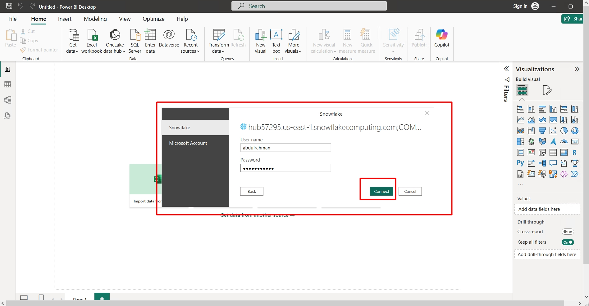
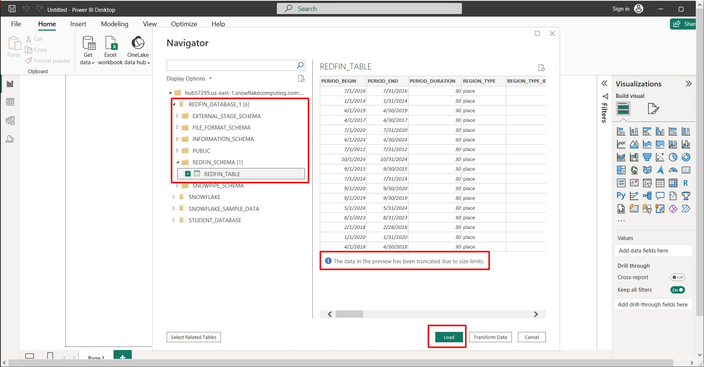

# 🚀 Automated Big Data ETL Pipeline: Scalable Processing with AWS EMR, Airflow, and Snowflake ❄️

## 🏢 Introduction

This project demonstrates how to build an **automated big data ETL pipeline** using **Apache Airflow 📚**, **Amazon EMR 📊**, **Amazon S3 💾**, and **Snowflake ❄️**. The pipeline:

- 🏭 **Creates an EMR Cluster**
- 🔥 Runs **Spark jobs** to process raw data
- 💾 Stores the transformed data in **Amazon S3**
- ❄️ Loads the processed data into **Snowflake**
- 🚫 Shuts down the **EMR cluster** after processing

The DAG is orchestrated using **Apache Airflow**, automating the entire ETL process. ⚙️

---

## 📁 Repository Structure

### 🛠️ Clone the Project

```sh
git clone https://github.com/Abd-al-RahmanH/Automated-Big-Data-ETL-Pipeline-Scalable-Processing-with-AWS-EMR-Airflow-and-Snowflake.git

cd Automated-Big-Data-ETL-Pipeline-Scalable-Processing-with-AWS-EMR-Airflow-and-Snowflake
```

### 📌 Project Files

```
FINAL_EMR_REDFIN/
│-- dags/
│   ├-- redfin_analytics.py       # Airflow DAG for EMR cluster and Spark jobs
│
│-- scripts/
│   ├-- ingest.sh                 # Shell script for data ingestion
│   ├-- transform_redfin_data.py  # Spark script for data transformation
│
│-- commands.txt  # Commands for setting up AWS & Airflow
│-- README.md     # Project Documentation
│-- requirements.txt  # Python dependencies
```

---

## ⚡ Prerequisites

Before running the project, ensure you have the following:

✔️ **AWS Account** with permissions for VPC, S3, EMR, IAM, and Snowflake integration  
✔️ **S3 Bucket** for raw and processed data  
✔️ **Apache Airflow 📚** installed and configured  
✔️ **AWS credentials** configured in Airflow  
✔️ **Snowflake ❄️ Account** with the necessary database and tables  

---

## 🛡️ Step 1: Setting Up a VPC

Before creating an S3 bucket, set up a **VPC (Virtual Private Cloud)** to ensure a secure and controlled networking environment.

### 🔹 Create a VPC

```sh
aws configure #Then Enter your access key ,secret accesskey and region.
aws ec2 create-vpc --cidr-block 10.0.0.0/16
```

### 🔹 Create a Subnet

```sh
aws ec2 create-subnet --vpc-id <your-vpc-id> --cidr-block 10.0.1.0/24
```

### 🔹 Create an Internet Gateway

```sh
aws ec2 create-internet-gateway
aws ec2 attach-internet-gateway --vpc-id <your-vpc-id> --internet-gateway-id <your-igw-id>
```

### Create in UI by follow the image


---

## 💾 Step 2: Setting Up an S3 Bucket

Create an **S3 bucket** with the following structure:

```
s3://redfin-emr-project/
├-- raw-data/            # Stores raw CSV data
├-- scripts/             # Stores Spark and ingestion scripts
├-- transformed-data/    # Stores processed parquet files
├-- emr-logs/            # Stores EMR logs
```


Upload necessary scripts to the S3 bucket:

```sh
aws s3 cp scripts/ s3://redfin-emr-project/scripts/ --recursive
```

---

## 🔄 Step 3: Configuring Airflow DAG

The **redfin_analytics.py** DAG automates the ETL workflow.

### 🔗 DAG Flow:

1️⃣ **Start pipeline** (`tsk_start_pipeline`)  
2️⃣ **Create EMR cluster** (`tsk_create_emr_cluster`)  
3️⃣ **Check cluster status** (`tsk_is_emr_cluster_created`)  
4️⃣ **Submit Spark jobs** (`tsk_add_extraction_step`, `tsk_add_transformation_step`)  
5️⃣ **Check Spark job completion** (`tsk_is_extraction_completed`, `tsk_is_transformation_completed`)  
6️⃣ **Load data into Snowflake** (`tsk_load_to_snowflake`)  
7️⃣ **Terminate EMR cluster** (`tsk_remove_cluster`)  
8️⃣ **End pipeline** (`tsk_end_pipeline`)  

### ⚡ Key Configurations in the DAG

Ensure to update the following in `redfin_analytics.py`:

- ✅ **Change the Subnet ID**: `Ec2SubnetId": "subnet-XXXXXX"`
- ✅ **Update EMR Cluster Name**: `"Name": "Your-EMR-Cluster-Name"`
- ✅ **Specify Your Key Name**: `"Ec2KeyName": "YourKeyName"`
- ✅ **Update S3 Bucket Name**: `s3://your-default-bucket-name/`

## Make sure u add the role from the commnads.txt


---

## ▶️ Step 4: Running the DAG

1️⃣ Start the **Airflow webserver and scheduler**:

```sh
airflow webserver -p 8080 &
airflow scheduler &
```

2️⃣ Open **Airflow UI** (http://localhost:8080)  and get th password from the terminal
3️⃣ Enable the DAG: `redfin_analytics_spark_job_dag` by clicking play button



4️⃣ Trigger the DAG manually or wait for its scheduled execution  

## ▶️ Step 5: The job runs
1. After you executed the job will creat the **EMR cluster**


2. It will fetch the raw data


3. It will passed to spark jobs from processing and put the changed job in transformed data s3 bucket


4. After that the emr cluster will be terminated automatically


5. And the job is completed


---

## ❄️ Step 6: Setting Up Snowflake for Data Storage and Querying

Now that the ETL pipeline has processed the data and stored it in Amazon S3, the next step is to load it into **Snowflake** for further analysis.

### 🏗️ Creating a Snowflake Account

1. **Sign up for a Snowflake account** [here](https://signup.snowflake.com/).
2. **Login to the Snowflake console** and navigate to the **Worksheets** section.
3. **Create a new worksheet** to run SQL queries.

### 📌 Executing Snowflake Queries

1. Open the `snowflake_dbscripts.txt` file.
2. Copy each SQL query and execute it in Snowflake.
3. Ensure you **replace the S3 bucket name** with your actual bucket where the final cleaned CSV is stored.

#### Example Query to Create an External Stage:
```sql
CREATE OR REPLACE STAGE redfin_stage
URL = 's3://redfin-emr-project/transformed-data/'
FILE_FORMAT = (TYPE = 'CSV' FIELD_OPTIONALLY_ENCLOSED_BY='"');
```

#### Example Query to Load Data into Snowflake Table:
```sql
COPY INTO redfin_housing_data
FROM @redfin_stage
FILE_FORMAT = (TYPE = 'CSV' FIELD_OPTIONALLY_ENCLOSED_BY='"')
ON_ERROR = 'CONTINUE';
```

### 🔍 Verify Data in Snowflake
Run the following query to verify the loaded data:
```sql
SELECT * FROM redfin_housing_data LIMIT 10;
```





---

## 📊 Step 7: Connecting Snowflake to a BI Tool

Once the data is available in Snowflake, it can be visualized using **BI tools** like **Tableau, Power BI, or Looker**.

### 🛠️ Connecting Snowflake to Power BI

Follow these steps to integrate Snowflake with Power BI:

1. Open **Power BI Desktop**.
2. Click on **Get Data** → **More**.


3. Select **Snowflake** as the data source.
4. Enter the **Snowflake account URL**.


5. Provide **username & password**.


6. Select the **warehouse, database, and schema**.


7. Load the data into Power BI and start creating dashboards.
---

## 🎥 Final Output: Watch the Data Pipeline in Action!

Check out the complete execution of the **Automated Big Data ETL Pipeline** in the following GIF:


---
## 🛠️ Troubleshooting

### ❗ Common Issues & Fixes

- ❌ **EMR creation fails?** Ensure correct **subnet ID** and **AWS key pair**.
- ❌ **S3 path issues?** Verify bucket structure and permissions.
- 🔍 **Airflow task failure?** Check **task logs** and IAM roles.

---

## 🚀 Conclusion

This end-to-end **Big Data ETL Pipeline** demonstrates how to automate data processing using **AWS EMR, Apache Airflow, and Snowflake**. By following this approach, organizations can efficiently handle large-scale data transformations and integrate with BI tools for analysis.

### ✅ Key Takeaways:
- Used **Apache Airflow** to automate the ETL process.
- Processed raw data using **Spark on AWS EMR**.
- Stored the transformed data in **Amazon S3**.
- Loaded the cleaned data into **Snowflake**.
- Connected Snowflake to **Power BI** for data visualization.

For any questions or improvements, feel free to drop a comment below! 🚀
 

